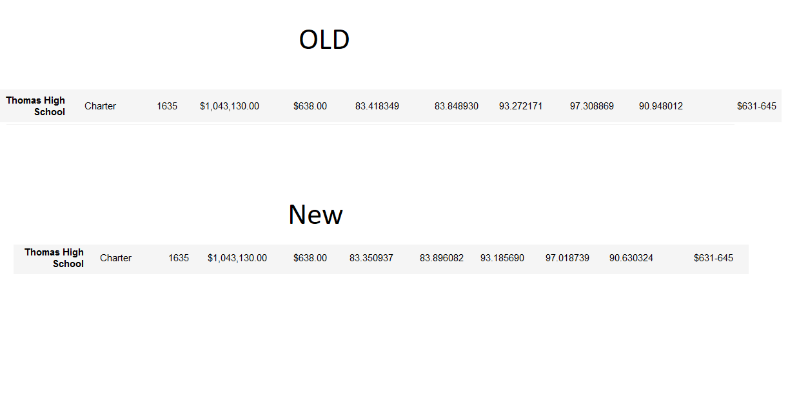

# School_District_Analysis.
An analysis of the school district. 

## Analysis Update
It has been discovered that the data from the 9th graders at Thomas High School is invalid. The analaysis will need to be adjusted so that this invalid data does not skew the results.

# Comparison
## District Summery

The district summery has not changed much. The data is comperable to the privous data without the removal of Thomas High School's 9th grade

## School Summary

There was a slight drop in averages as can be seen in the School Summary.

## How does replacing the ninth graders’ math and reading scores affect Thomas High School’s performance relative to the other schools?

Very little is affected, Thomas still maintains second in the top five preforming school. 

## How does replacing the ninth-grade scores affect the following:

* Math and reading scores by grade
A small drop in average can be noticed.

* Scores by school spending

No change can be seen
* Scores by school size

No change can be seen
* Scores by school type

No change can be seen

# Summary

In summary, removing the scores from the Thomas High Schools's 9th grade affects the scores at a negligable amount. No change can be noticed in spending, type, or size. 

Thomas High School still maintains second in top five preforming schools. 
